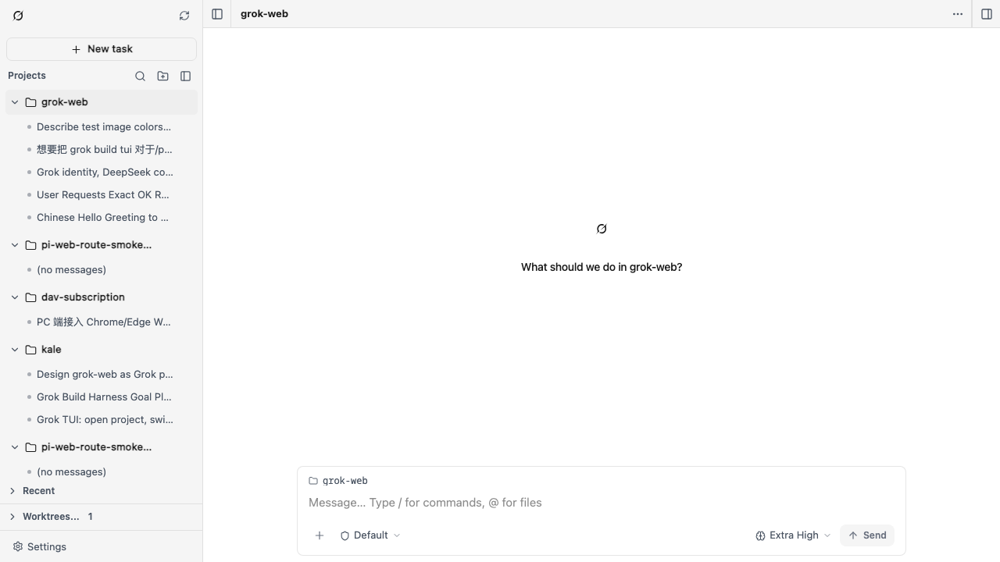

# Grok Web

Grok Build 的本地浏览器工作区。它挂在一个长期运行的 `grok agent` ACP 进程和现有的 `~/.grok` 主目录前面，因此 TUI 和网页可以继续同一批会话。

这是给本机单人使用的社区 0.x 预览。**不是** xAI 官方产品，与 xAI 无隶属关系，也不是托管的多租户 Grok。浏览器不会直接讲 ACP。

源码：[github.com/icekale/grok-web](https://github.com/icekale/grok-web)。英文说明：[README.md](README.md)。



## 要求

- Node.js `>= 22.19.0`
- `PATH` 上有 `grok` CLI（[Grok Build](https://x.ai/news/grok-build-cli)）。本仓库不锁定具体 CLI 版本，请使用仍支持 ACP 的较新 Grok Build。

## 运行

```bash
npm install
npm run dev
```

默认监听 `http://127.0.0.1:30142`。回环地址不需要登录。

```bash
npm run start
```

以同样方式启动打包后的服务。`npm run dev:lan` / `npm run start:lan` 绑定 `0.0.0.0`，供同一信任域的局域网使用。

## 远程访问

非回环绑定需要密码。设置 `GROK_WEB_PASSWORD`，或在设置里配置。Basic Auth 用户名为 `grok`。

密码会经过不信任网络时，请使用 HTTPS 或受信任的 VPN。

## 环境变量

| 变量 | 作用 |
| --- | --- |
| `GROK_HOME` | 覆盖 Grok 主目录（默认 `~/.grok`） |
| `GROK_WEB_PASSWORD` | 远程密码，优先于已保存的哈希 |
| `GROK_WEB_HOSTNAME` | 绑定 / 对外公布的主机名 |
| `GROK_WEB_ALLOWED_HOSTS` | 额外允许的 Host，逗号分隔 |
| `GROK_WEB_NO_OPEN` | 设置后不自动打开浏览器 |

## 数据

会话、认证、模型、skills 和 MCP 存放在 `~/.grok`。仅属于本应用的元数据在 `~/.grok/grok-web/`。远程访问配置是 `~/.grok/grok-web.json`（若只剩旧的 `pi-web.json`，会复制一次）。

## 架构

```
浏览器 UI  --HTTP/SSE-->  本机 Node 网关  --ACP stdio-->  grok agent
                                   |
                                   +-->  ~/.grok
```

## 排障

| 现象 | 先看 |
| --- | --- |
| 找不到 `grok` | 安装 Grok Build，并确认 `grok` 在 `PATH` 上 |
| Node 版本不受支持 | 需要 `>= 22.19.0`（`node -v`） |
| 端口被占用 | 停掉占用 `30142` 的进程，或传 `-p` |
| 拒绝局域网绑定 | 设置至少 12 位的 `GROK_WEB_PASSWORD`，或只绑 `127.0.0.1` |
| 会话一直只读 | TUI 可能已经占用该会话；另开一个或重试 |

```bash
npm test
npm run lint
npm run typecheck
npx playwright install chromium
npm run test:e2e
```

`npm test` 不拉起 `grok`。`npm run test:e2e` 会启动 Vite 应用，并确认操作界面能对着本机 `PATH` 上的 `grok` 加载。

## 发布

```bash
npm run pack:tanstack
```

会构建 TanStack 服务、暂存包含 CLI 的包，并在临时目录生成 tarball。不要在仓库根目录执行 `npm publish`。

## 支持

0.x 是尽力而为。主版本仍为 0 时，公开接口可以不经大版本号变更。不承诺兼容其他网页 UI。

## 许可证

MIT。见 [LICENSE](LICENSE) 和 [THIRD_PARTY_NOTICES.md](THIRD_PARTY_NOTICES.md)。

工作区界面改编自 [pi-web](https://github.com/icekale/pi-web)。
